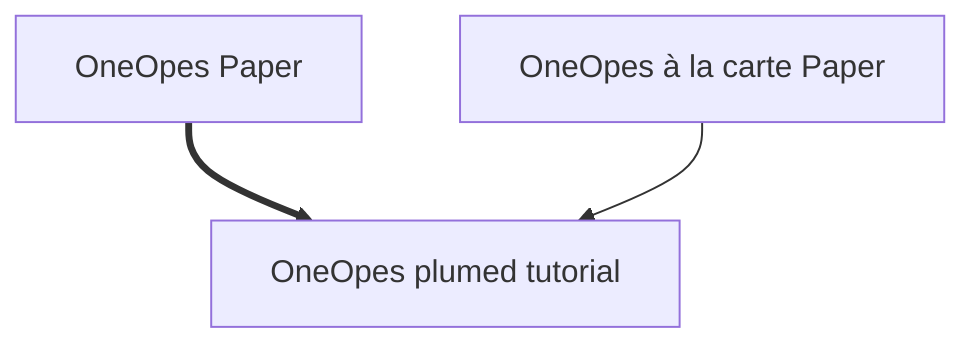

# OneOPES Tutorial for Host-Guest Systems with PLUMED

This tutorial explains how to set up and run OneOPES simulations for host-guest systems using PLUMED[[2]](#1). OneOPES[[2]](#2) is a combined enhanced sampling method that exploits replica exchange and can accelerate several collective variables simultaneously.

<a id="1">[1]</a>  Martinez, Pedro Febrer, et al. Host-Guest Binding Free Energies à La Carte: An Automated OneOPES Protocol. bioRxiv, 24 Aug. 2024 [doi:10.1101/2024.08.23.609378](https://doi.org/10.1101/2024.08.23.609378).

<a id="2">[1]</a>  Rizzi, V.; Aureli, S.; Ansari, N.; Gervasio, F. L. OneOPES, a Combined Enhanced Sampling Method to Rule Them All. Journal of Chemical Theory and Computation 2023, 19, 5731–5742 [doi:10.1021/acs.jctc.3c00254](https://doi.org/10.1021/acs.jctc.3c00254).

